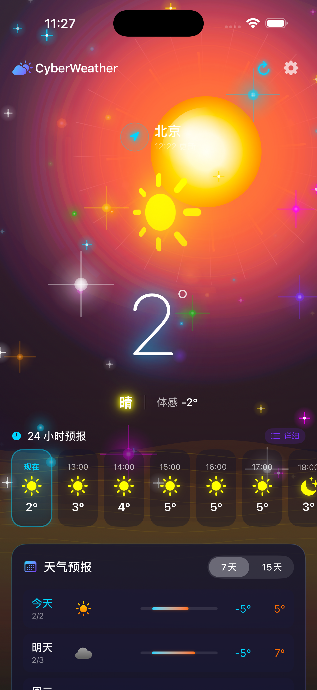
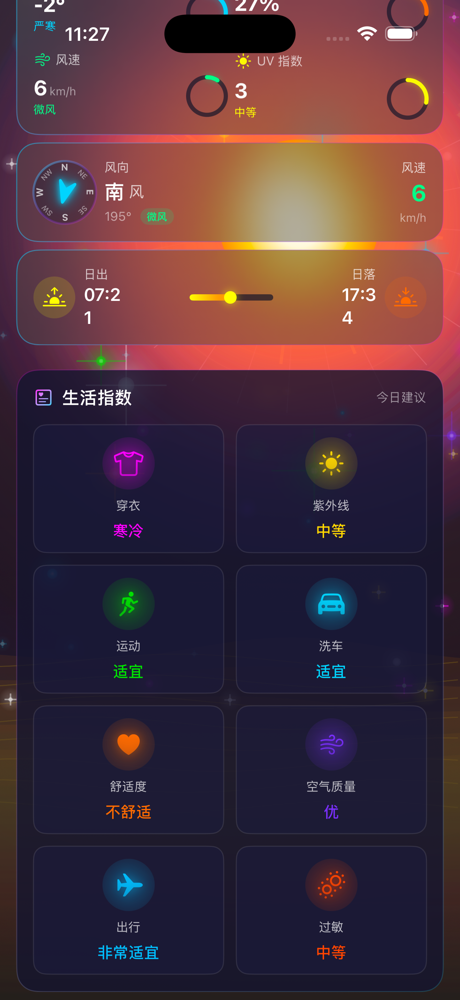
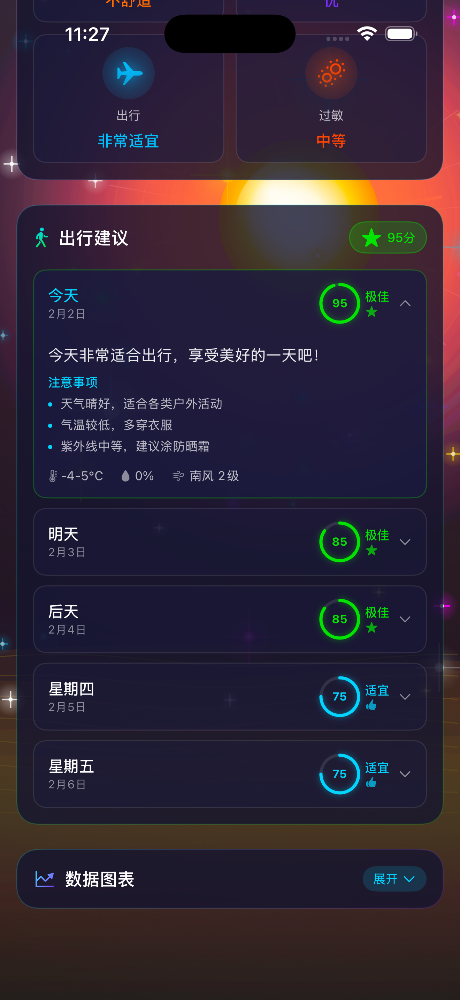
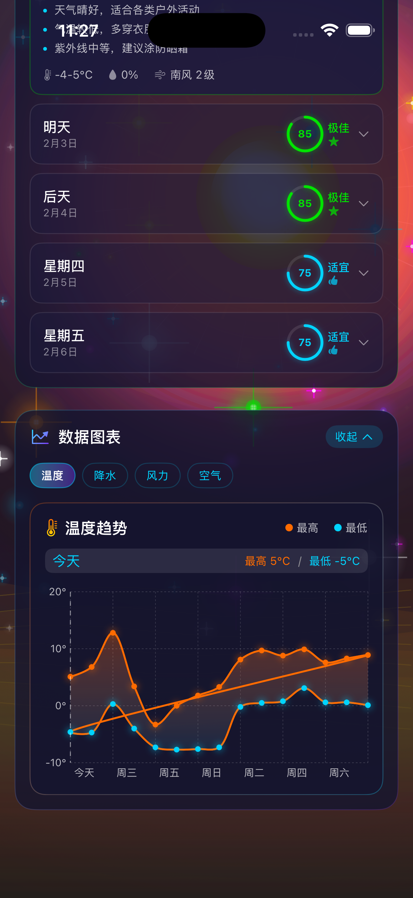
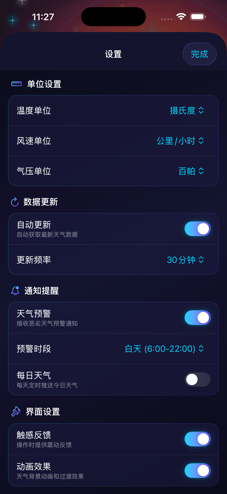

<p align="center">
  
</p>

<h1 align="center">CyberWeather</h1>

<p align="center">
  
</p>

<p align="center">
  <strong>赛博朋克风格天气应用</strong>
  <br>
  <em>Cyberpunk-styled Weather App with Stunning Animations</em>
</p>

<p align="center">
  
  
  
  
</p>

<p align="center">
  
  
</p>

---

## 📱 应用截图 Screenshots

<p align="center">
  
  
  
  
  
</p>

<p align="center">
  <sub>主界面 · 生活指数 · 出行建议 · 数据图表 · 设置</sub>
</p>

---

## 🎬 演示视频 Demo

<p align="center">
  <a href="./demo.mp4">
    
  </a>
</p>

---

## ✨ 功能特性 Features

<table>
<tr>
<td width="50%">

### 🌤️ 天气动画
| 天气 | 效果 |
|:---:|:---|
| ☀️ 晴天 | 发光太阳 + 热浪 + 漂浮光斑 |
| ☁️ 多云 | 漂浮云朵 + 柔和光影 |
| 🌧️ 雨天 | 霓虹雨滴 + 涟漪效果 |
| ❄️ 雪天 | 飘落雪花 + 冰晶闪烁 |
| ⛈️ 雷暴 | 闪电效果 + 暴雨 |
| 🌫️ 雾天 | 流动薄雾 + 朦胧光晕 |
| 🌙 夜间 | 星空 + 月光 + 流星 |

</td>
<td width="50%">

### 📊 数据功能
- **实时天气** - 温度、体感、天气状况
- **24小时预报** - 逐小时温度和降水
- **15天预报** - 每日温度趋势
- **生活指数** - 穿衣/运动/洗车/紫外线
- **出行建议** - 智能出行评分
- **数据图表** - 温度/降水/风力趋势

</td>
</tr>
</table>

### 🎨 视觉设计

<p align="center">
  
  
  
  
</p>

- **霓虹发光** - 多层阴影打造真实霓虹效果
- **玻璃拟态** - 半透明毛玻璃质感卡片
- **60fps动画** - Canvas + TimelineView 高性能渲染
- **GPU加速** - drawingGroup() 优化

---

## 🛠️ 技术栈 Tech Stack

<p align="center">
  
  
  
</p>

| 技术 | 说明 |
|:---:|:---|
| **SwiftUI** | 100% 原生 UI 框架 |
| **Combine** | 响应式数据绑定 |
| **Canvas** | 高性能粒子渲染 |
| **Charts** | 原生数据图表 |
| **CoreLocation** | 定位服务 |
| **MVVM** | 清晰的架构设计 |

---

## 🚀 快速开始 Quick Start

### 环境要求

<p align="center">
  
  
  
</p>

### 安装运行

```bash
# 克隆仓库
git clone https://github.com/Pangu-Immortal/CyberWeather.git

# 打开项目
cd CyberWeather && open CyberWeather.xcodeproj

# 选择模拟器或真机，按 Cmd+R 运行
```

> 💡 **无需 API Key** - 使用免费的 Open-Meteo API，开箱即用

---

## 📁 项目结构 Structure

```
CyberWeather/
├── Models/              # 数据模型
├── Services/            # 网络和定位服务
├── ViewModels/          # 业务逻辑
├── Views/
│   ├── Animations/      # 7种天气动画
│   ├── Components/      # 可复用组件
│   └── Charts/          # 数据图表
├── Styles/              # 主题和动画样式
└── Extensions/          # 扩展工具
```

---

## 🙏 致谢 Credits

- [Open-Meteo](https://open-meteo.com/) - 免费天气 API
- [SF Symbols](https://developer.apple.com/sf-symbols/) - Apple 官方图标库

---

## Star History

[](https://star-history.com/#Pangu-Immortal/CyberWeather&Date)

---

## 📄 License

This project is licensed under the MIT License - see the [LICENSE](LICENSE) file for details.

---

<p align="center">
  <strong>喜欢这个项目？给个 ⭐ Star 支持一下！</strong>
</p>

<p align="center">
  Made with 💜 by <a href="https://github.com/Pangu-Immortal">Pangu-Immortal</a>
</p>
