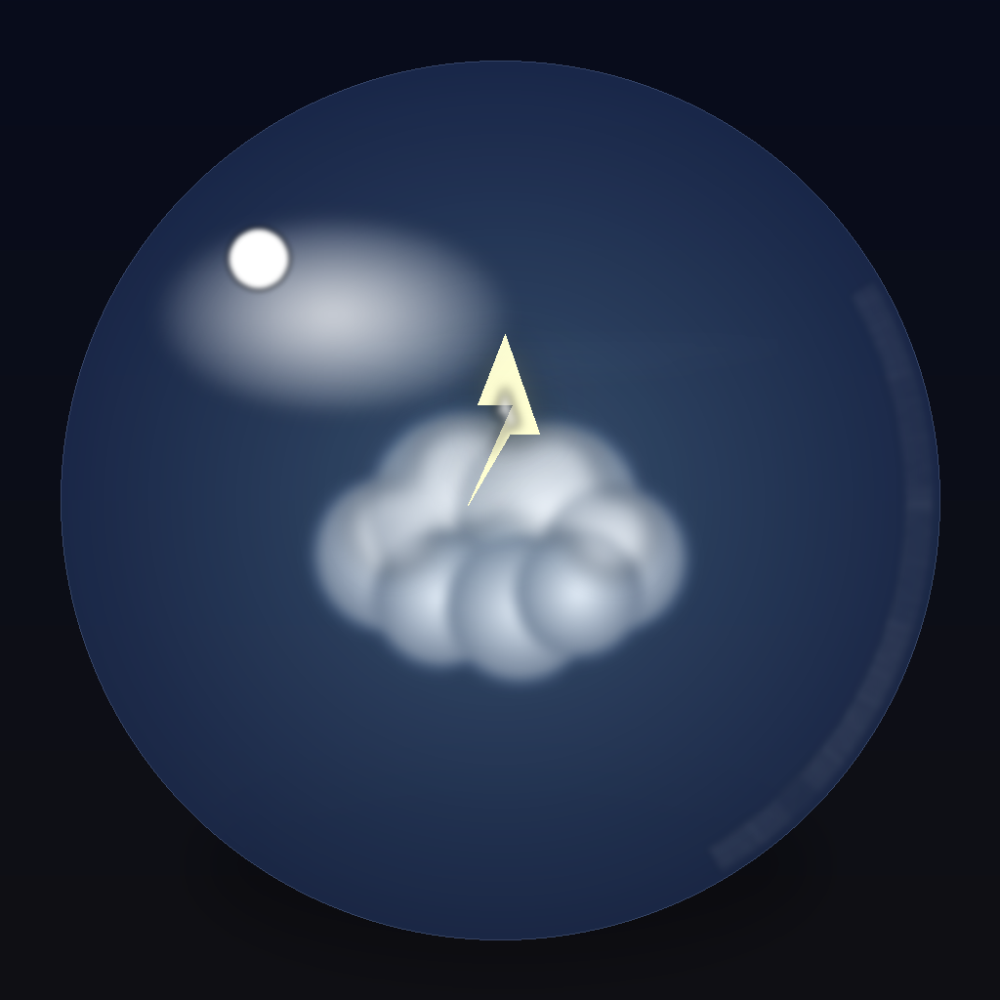

<p align="center">
  
</p>

<h1 align="center">CyberWeather</h1>

<p align="center">
  <strong>赛博朋克风格天气应用</strong>
  <br>
  <em>Cyberpunk-styled Weather App with Stunning Animations</em>
</p>

<p align="center">
  
  
  
  
  
</p>

<p align="center">
  
  
  
</p>

<p align="center">
  
  
  
</p>

<p align="center">
  
  
  
  
</p>

---

## 📊 项目统计 Project Stats

<p align="center">
  
  
  
</p>

<p align="center">
  
  
  
  
</p>

| 📈 指标 | 数值 | 说明 |
|:------:|:----:|:-----|
| 📁 **源文件** | 25+ | Swift 源代码文件 |
| 🎬 **动画类型** | 7 | 晴/云/雨/雪/雾/雷/夜 |
| 🧩 **组件** | 15+ | 可复用 UI 组件 |
| 📊 **图表** | 3 | 温度/降水/风力图表 |
| 🔗 **依赖** | 0 | 零第三方依赖 |
| ⚡ **帧率** | 60fps | 流畅动画体验 |

---

## 🌤️ 天气动画预览 Weather Animations

<p align="center">
  
  
  
  
</p>

<p align="center">
  
  
  
</p>

| 天气类型 | 主要效果 | 粒子数量 | 特殊效果 |
|:-------:|:-------:|:-------:|:-------:|
| ☀️ 晴天 | 发光太阳 + 热浪 | 25+ 光斑 | 全屏辉光 |
| ☁️ 多云 | 漂浮云朵 | 8 朵云 | 柔和光影 |
| 🌧️ 雨天 | 霓虹雨滴 | 100+ 雨滴 | 涟漪效果 |
| ❄️ 雪天 | 飘落雪花 | 80+ 雪花 | 冰晶闪烁 |
| ⛈️ 雷暴 | 闪电效果 | 150+ 雨滴 | 雷电闪烁 |
| 🌫️ 雾天 | 流动薄雾 | 6 层雾 | 朦胧光晕 |
| 🌙 夜间 | 星空月光 | 60+ 星星 | 流星划过 |

---

## 🎨 配色方案 Color Palette

<p align="center">
  
  
  
  
</p>

<p align="center">
  
  
  
  
</p>

```swift
// 霓虹色系
neonBlue   = #00D4FF  // 主色调 - 霓虹蓝
neonPurple = #7B2FFF  // 辅助色 - 霓虹紫
neonPink   = #FF00FF  // 强调色 - 霓虹粉
neonGreen  = #00E400  // 成功色 - 霓虹绿
neonOrange = #FF6B00  // 警告色 - 霓虹橙
neonYellow = #FFD700  // 高亮色 - 霓虹金

// 背景色系
darkBackground = #0A0A1A  // 深紫黑
cardBackground = #141428  // 卡片背景（70% 透明度）
```

---

## 📱 演示 Demo

<p align="center">
  <a href="./demo.mp4">
    
  </a>
</p>

<p align="center">
  <em>📹 点击上方按钮下载 demo.mp4 查看完整演示</em>
</p>

### 主要界面

| 晴天效果 | 雨天效果 | 夜间效果 |
|:-------:|:-------:|:-------:|
| ☀️ 发光太阳 | 🌧️ 霓虹雨滴 | 🌙 星空流星 |
| 热浪光晕 | 涟漪效果 | 月光柔和 |
| 漂浮光斑 | 云层流动 | 星星闪烁 |

---

## ✨ 特性 Features

### 🎨 视觉设计
- **霓虹发光效果** - 多层阴影叠加，打造真实霓虹灯效果
- **玻璃拟态** - 半透明毛玻璃质感卡片
- **动态渐变** - 流动的赛博朋克配色
- **粒子系统** - 漂浮光斑、闪烁星星、能量流

### 📊 数据功能
- **实时天气** - 当前温度、体感温度、天气状况
- **24小时预报** - 逐小时温度、降水概率
- **15天预报** - 每日最高/最低温度、天气趋势
- **天气详情** - 湿度、气压、能见度、紫外线指数
- **生活指数** - 穿衣、运动、洗车、紫外线等建议
- **出行建议** - 智能出行提醒
- **数据图表** - 温度趋势、降水分布、风力变化

### 🛠️ 技术特性
<p align="center">
  
  
  
  
</p>

- 100% **SwiftUI** 原生开发
- **60fps** 流畅动画
- **Canvas + TimelineView** 高性能渲染
- **GPU 加速** drawingGroup() 优化
- **MVVM** 架构设计
- **无需 API Key** - 使用免费 Open-Meteo API

---

## 🏗️ 项目结构

```
CyberWeather/
├── CyberWeatherApp.swift          # App 入口
├── ContentView.swift              # 主视图容器
│
├── Models/                        # 数据模型
│   ├── WeatherModel.swift         # 天气数据结构
│   └── AppSettings.swift          # 应用设置
│
├── Services/                      # 服务层
│   ├── WeatherService.swift       # API 请求服务
│   └── LocationService.swift      # 定位服务
│
├── ViewModels/                    # 视图模型
│   └── WeatherViewModel.swift     # 天气业务逻辑
│
├── Views/                         # 视图组件
│   ├── MainWeatherView.swift      # 主天气视图
│   ├── HourlyForecastView.swift   # 小时预报
│   ├── DailyForecastView.swift    # 每日预报
│   ├── WeatherDetailView.swift    # 天气详情
│   ├── LifeIndexView.swift        # 生活指数
│   ├── SettingsView.swift         # 设置页面
│   │
│   ├── Animations/                # 天气动画
│   │   ├── WeatherAnimationView.swift  # 动画路由器
│   │   ├── SunnyAnimation.swift        # 晴天动画
│   │   ├── CloudyAnimation.swift       # 多云动画
│   │   ├── RainyAnimation.swift        # 雨天动画
│   │   ├── SnowyAnimation.swift        # 雪天动画
│   │   ├── FoggyAnimation.swift        # 雾天动画
│   │   └── NightAnimation.swift        # 夜间动画
│   │
│   ├── Components/                # 可复用组件
│   │   ├── GlowingText.swift      # 霓虹发光文字
│   │   ├── GlassCard.swift        # 玻璃拟态卡片
│   │   ├── NeonIcon.swift         # 霓虹图标
│   │   ├── CyberBackground.swift  # 赛博背景
│   │   └── ParticleView.swift     # 粒子效果
│   │
│   └── Charts/                    # 数据图表
│       ├── TemperatureChartView.swift  # 温度图表
│       ├── PrecipitationChartView.swift # 降水图表
│       └── WindChartView.swift         # 风力图表
│
├── Styles/                        # 样式定义
│   ├── CyberTheme.swift           # 主题配色
│   └── CyberAnimations.swift      # 动画工具
│
└── Extensions/                    # 扩展
    ├── Color+Cyber.swift          # 颜色扩展
    └── View+Glow.swift            # 发光效果扩展
```

---

## 🚀 快速开始

### 环境要求

<p align="center">
  
  
  
</p>

### 安装步骤

1. **克隆仓库**
```bash
git clone https://github.com/AuroraPixel/CyberWeather.git
cd CyberWeather
```

2. **打开项目**
```bash
open CyberWeather.xcodeproj
```

3. **运行**
- 选择目标设备（iPhone 模拟器或真机）
- 点击 ▶️ Run 或按 `Cmd + R`

### 权限说明
应用需要以下权限：
- **定位权限** - 获取当前位置的天气信息（可选，拒绝后使用默认城市）

---

## 🌐 API 说明

<p align="center">
  
  
  
</p>

本项目使用 [Open-Meteo](https://open-meteo.com/) 免费天气 API：

- **无需注册** - 无需 API Key
- **免费使用** - 每日 10,000 次请求
- **数据丰富** - 实时天气 + 7/15天预报 + 小时预报
- **全球覆盖** - 支持全球任意经纬度

---

## 📦 依赖项

<p align="center">
  
</p>

本项目 **零第三方依赖**，完全使用 Apple 原生框架：

| 框架 | 用途 | 版本 |
|:---:|:----:|:----:|
|  | UI 框架 | iOS 17+ |
|  | 响应式编程 | iOS 13+ |
|  | 定位服务 | iOS 2+ |
|  | 数据图表 | iOS 16+ |

---

## 🤝 贡献指南

<p align="center">
  
  
</p>

欢迎提交 Issue 和 Pull Request！

1. Fork 本仓库
2. 创建特性分支 (`git checkout -b feature/AmazingFeature`)
3. 提交更改 (`git commit -m 'Add some AmazingFeature'`)
4. 推送到分支 (`git push origin feature/AmazingFeature`)
5. 提交 Pull Request

---

## 📄 开源协议

<p align="center">
  
</p>

本项目采用 [MIT License](LICENSE) 开源协议。

---

## 🙏 致谢

- [Open-Meteo](https://open-meteo.com/) - 免费天气 API
- [SF Symbols](https://developer.apple.com/sf-symbols/) - Apple 官方图标库
- 所有为赛博朋克美学做出贡献的设计师们

---

<p align="center">
  <strong>如果觉得这个项目不错，请给个 ⭐ Star 支持一下！</strong>
</p>

<p align="center">
  
</p>

<p align="center">
  Made with 💜 by CyberWeather Team
</p>
